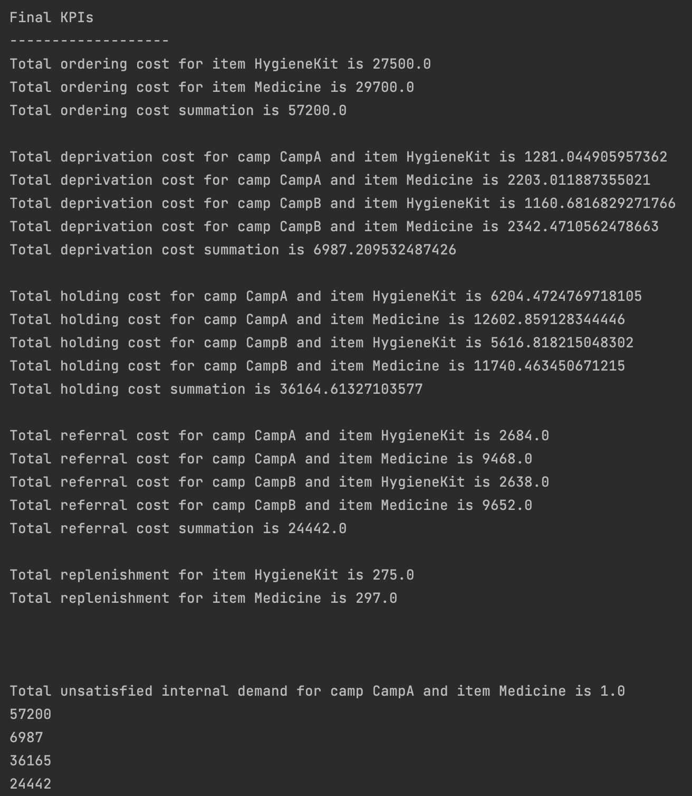

# PostDisasterInventorySimulation

## Context
The primary purpose of this project is to provide a simulation-based approach to complement the analytical model developed within the scope of the Coordination and Management of Uncertainty in Refugee Camp Inventory Operations project. By simulating various scenarios, this study seeks to extract valuable managerial insights, showcasing how proposed policies and strategies could be implemented in real-life situations. The simulation will provide practical implications of different scenarios, enabling users to draw meaningful conclusions where analytical solutions may be difficult or unattainable.

## Inputs and Features

### 1. Data
Under the data package, there are config file and data objects to be implemented as input to the simulation.

- **Config**: There are configuration structures that vary depending on whether the input is random or predefined.
- **Agency**: `Agency` class contains information about the agency's name and funding type.
- **Camp**: `Camp` class contains information about the camp's name, demand, camp external demand satisfaction type, and population.
- **Demand**: `Demand` class keeps information about the distribution type, mean, and standard deviation of the demand.
- **Environment**: This class represents the simulation environment that includes various entities such as camps, agencies, items, and simulation configurations. By having two separate constructors in this class, users can create `Environment` objects with appropriate initialization based on the file being read, whether it is `input.yaml` or `randomConfig.yaml`.
- **IDistParameters**: The `IDistParameters` interface defines a set of common distribution parameters used in statistical distributions. It works as an outline for classes that implement specific distribution types. By implementing this interface, classes can utilize these common distribution parameters and provide a standardized way to access and manipulate them.
- **Item**: This class represents an item within the simulation. It contains information about the item's name, demand type, and perishability.
- **RandomConfig**: The `RandomConfig` class represents the configuration for generating random instances in the simulation. It contains various properties that define the behavior and characteristics of the random instances. The `RandomConfig` class can be instantiated and configured based on the provided YAML (`randomConfig.yaml`) configuration. By using the `RandomConfig` class, users can easily configure the generation of random instances within the simulation, aligning with the values specified in the YAML configuration.
- **RandomEventData**: The `RandomEventData` class represents data related to random events in the simulation. It contains information about the distribution type, event type, and distribution parameters associated with the random event. By using the `IDistParameters` interface and the type parameter `T`, the `RandomEventData` class provides flexibility to work with different types of distribution parameters while ensuring that they adhere to the structure defined by the `IDistParameters` interface.
- **SimulationConfig**: The `SimulationConfig` class represents the configuration for the simulation and contains four properties: `seedDemand`, `seedFunding`, `seedSupply`, and `seedMigration`. These properties determine the seed values for different aspects of the simulation. By setting these values in the `simulationConfig.yaml` file, users can control the initial seed values for demand, funding, supply, and migration aspects of the simulation. These seed values are essential for generating random or pseudo-random numbers and ensuring reproducibility in the simulation results.
- **NormalDistParameters**: This class represents the specific parameters, which are mean and standard deviation, for a normal distribution. It implements the `IDistParameters` interface, which defines a set of common distribution parameters used in statistical distributions.
- **PoissonDistParameters**: This class represents the specific parameter, which is mean, for a Poisson distribution. It implements the `IDistParameters` interface, which defines a set of common distribution parameters used in statistical distributions.
- **TriangularDistParameters**: This class represents the specific parameters, which are min, max, and mode, for a triangular distribution. It implements the `IDistParameters` interface, which defines a set of common distribution parameters used in statistical distributions.
- **UniformDistParameters**: This class represents the specific parameters, which are mean and standard deviation, for a normal distribution. It implements the `IDistParameters` interface, which defines a set of common distribution parameters used in statistical distributions.

### 2. Enums
The enums package contains a set of enum classes that define various types and statuses used in the system. These enums provide a standardized way of representing and categorizing different elements, such as distribution types, funding types, item demand types, population types, random event types, and supply status types.
- **CampExternalDemandSatisfactionType**: This enum represents different types of satisfaction levels for the external demand of a camp. It has three possible values:
    - **Fully**: Indicates that the camp's external demand is fully satisfied. This means that the camp receives all the required resources or support from external sources to meet its demand.
    - **Threshold**: Indicates that the camp's external demand is satisfied up to a certain threshold. The camp receives enough resources or support to meet a minimum level of demand, but additional resources may be needed to fully satisfy the demand.
    - **None**: Indicates that the camp's external demand is not satisfied at all. The camp does not receive any external resources or support to meet its demand and relies solely on internal resources or alternative means to fulfill its needs.
- **DistributionType**: The `DistributionType` enum represents different types of probability distributions that can be used to model random variables or events.
- **FundingType**: The `FundingType` enum represents different types of funding sources or methods.
- **ItemDemandType**: The `ItemDemandType` enum represents different types of demand patterns or occurrences for items.
- **PopulationType**: The `PopulationType` enum represents different types or categories of populations within the context of the system.
- **RandomEventType**: The `RandomEventType` enum represents different types of random events that can occur within the context of the current application.
- **SupplyStatusType**: The `SupplyStatusType` enum represents different status types for the availability of an item within the context of the application.

## Code Structure

### 1. Simulation

- **IEvent**: The `IEvent` interface defines the common behavior for all events in the simulation. It declares a public attribute `time` of type double with an initial value of 0.
- **DemandEvent**: The `DemandEvent` class extends the `IEvent` interface and adds a `time` attribute of type double. This attribute allows for specifying the exact time at which the demand event occurs.
- **FundingEvent**: The `FundingEvent` class represents an event related to funding within the simulation by providing type and timing. It is designed to track changes in funding and their associated timing.
- **MigrationEvent**: The `MigrationEvent` class is designed to track the occurrence of migration events and their associated timing. By using this class, users can accurately model and track migration events in the simulation.
- **ReplenishmentEvent**: The `ReplenishmentEvent` class is used to track the occurrence of replenishment events and their associated timing.
- **SupplyStatusSwitchEvent**: The `SupplyStatusSwitchEvent` class is used to track changes in the availability of the supply during the simulation.
- **Simulate**: The `Simulate` class is responsible for running a simulation based on the provided `Environment` object. It utilizes the `EventGenerator` class to generate random events during the simulation.
- **EventGenerator**: The `EventGenerator` class is responsible for generating random events during the simulation based on the provided configuration. It uses different `Random` instances for generating random numbers for different types of events: demand, funding, supply, and migration. In the constructor of the `EventGenerator` class, the seed values from the `SimulationConfig` object are used to initialize the `Random` instances for each type of event. These seed values ensure that the random numbers generated for each event type are consistent across different simulations.
- **State**: TO DO

## Outputs

Visualization:

